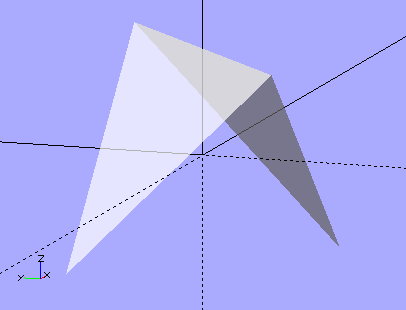
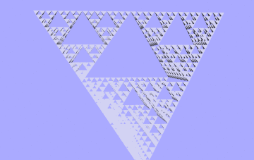
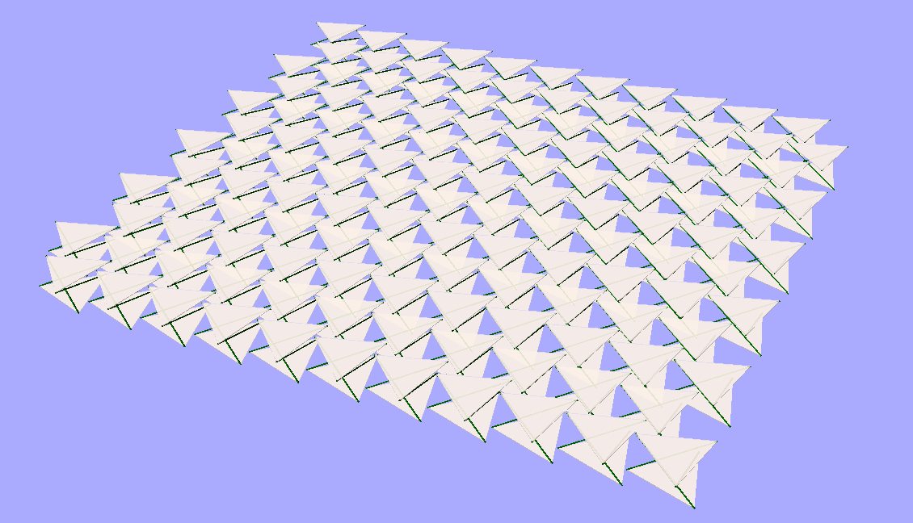
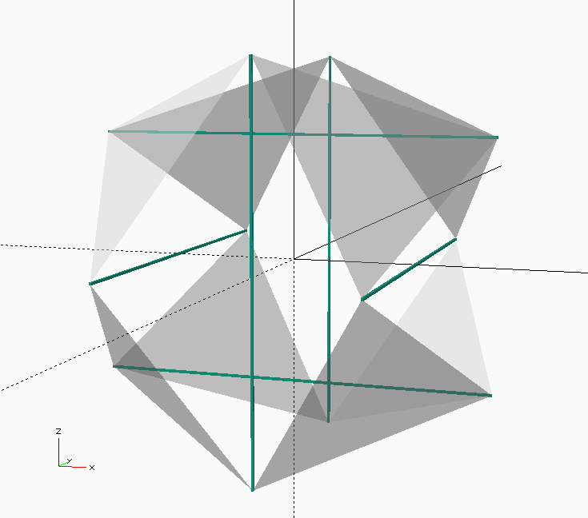
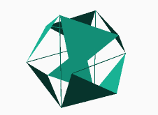

Cellular Fractal Structures
===============================

Cellular fractal structures are one of the basic design motifs.

- Cellular

  - Made of "cells"
    - simple units
    - (semi-)autonomous
    - Simple construction algorithms

  - connected in simple ways to form larger "multicellular" structures.
  - simulation using Finite Element Modeling

- Fractal

  - Self-similar on multiple scales
  - Concise descriptions
  - reusable designs and techniques

- Structures

  - volume-to-surface ratio constant as the structure scales.

    - `Alexander G. Bell's cellular kites`_.  Bell wanted to show that
      heavier-than-air craft were not doomed to be no more than bird-sized.

Tetrahedral Cell
---------------------------

Two sides of a tetrahedron approximate a `Rogallo wing`_.

We can connect four units together to make a `Sierpinski`_ gasket.

.. image:: images/tetra-cell-4x.png

We can repeat the process to make larger units.

.. image:: images/tetra-cell-16x.png

A Five-meta-tetrahedron.

From the top, orthogonal view you can see that the cells tile the plane because the
tetrahedra are all oriented inside virtual cubes and each x,y location
has a cube/tetra covering it.

Seen edge-on with perspective the flock is almost invisible.
This edge-on axis has the least resistance to airflow.

.. image:: images/tetra-cell-large-flock-edge-on-perspective.png

From the x=-y=z axis you get this lovely triangular symmetry.

From one point of view this structure is 2-dimensional, but it's also 
3-dimensional in the sense that it occupies a volume.

There are other possibilities.  This is what Bucky called `"Octet Truss"`_.

There's room to double up the triangles with a second octet truss.

You could assemble fractal units of, say, degree five, and then use those
to make the octet truss structures.  If the units are
approximately 3 meters along an edge then the 5-tetra would be 16 * 3 = 48
meters, and a stack of seven would 48 / √2 * 7 = 237.6 meters high.

(The minimum distance between two opposite edges of a tetrahedron is the
height of the cube defined by the tetrahedron's verticies.)

This kite would provide enough leftover lift to carry a payload (either
depending from it or embedded in it) in the form of a cabin and/or cargo.

You can "swim" through the air using several modes of undulation.  You
can have the cells themselves be flexible and capable of changing their
dimensions, you can have two or more stiff assemblies connected to each
other by flexible linkages, etc.

(Note the images above are all upside down compared to how kites are usually
constructed.  I think this would work but if I'm wrong then just turn the
tetras upsidedown.)

Tubes
---------------------------

Almost anything can be made into a fractal.  If we start with simple tubes
we can glue them together laterally to form triangular triplets, and then
repeat the process a few times to get `Sierpinski`_ gaskets, which can
then be tiled to make a very simple and sturdy planar structure.

.. image:: images/tubes-tiled.png

If the tubes vary in radius (in other words, if they are sections of
cones) they will naturally form curved surfaces.

.. image:: images/meta-cylinder.png

This is just a crude conceptual graphic, meant to illustrate the idea but
it's not to any particular scale.  Note the similarity to a (literal)
cell wall, which is formed out of two layers of moleculars.  The
molecules are hydrophillic on one end and hydrophobic on the other and
naturally arrange themselves into first bubbles, then tubes, then sheets,
(then tubes and then bubbles again) as the ratio of water to the other
stuff changes.

In this case the differential between the inside of the meta-tube and the
outside is thermal.  The meta-tube would be sealed at both ends and the
air inside allowed to heat up.  The outer surface of the sub-tubes is
dark while the inner surface is shiny, so therefore are the surfaces of
the meta-tube.  As the air in the tube heats up it expands and some of it
is pushed out of the meta-tube. When the mass of the displaced air is
greater than the mass of the tube it will become a hot-air balloon and
float.  This is Bucky's `Cloud 9`_ idea.

The units in these structures are not resting on the ones below them.
The cells are floating in addition to the entire structure.  You're
basically building larger hot-air balloons out of smaller ones.

Tensegrity Kites
---------------------------

The simplest Tensegrity structure is a three-strut triangular prism.
(The tethers connecting the top and bottom triangular sails are not shown
in this image.)

.. image:: images/rotating-tri-cell.gif

Top view, orthogonal

Each cell consists of:

- Two triangular sails
- Three struts
- Three tendons
- six interconnects

The construction would be something like:

#) Attach interconnects to the ends of the struts.
#) Set the struts in a jig to hold them in the proper formation.
#) Clip on the sails and tethers.

It's difficult to accurately imagine the stiffness and lightness of these
structures without building and handling physical models.

Tiling
^^^^^^^^^^^^^^^^^^

It can be tiled to make large kite "membranes":

The tricky bit seems to me to be the connection between kite cells.

Side view, orthogonal

Top view, orthogonal

And, again, if the "top" and "bottom" sails are different sizes the resulting
membranes will be curved.

Icosahedral Cell
---------------------------

- six struts
  - each of length Phi (~1.618..., where the edge length of the icosahedron is 1.)
  - the ends of the struts are twelve verticies of the icosahedron.
  - arranged in three pairs, each defining a 1xPhi or Golden Rectangle, 
    and each oriented on one of the three Cartesian axies in an interlocking pattern.

- eight equilateral triangles
  - icosa faces, edge length 1
  - octahedral symmetry.
  - other 12 faces and 6 edges are not part of the system

- Own frame of reference
- interconnected, self-stable web of tension and compression with no center
  (like how the surface of the Earth has no center, eh?).
- NASA robotics project (led by V. Sunspiral)

Three Golden Rectangles
^^^^^^^^^^^^^^^^^^^^^^^^^^^^^^^

.. image:: images/three-Golden-Rectangles.png

Platonic Icosahedron
^^^^^^^^^^^^^^^^^^^^^^^^^^^^^^^

Connect the corners of the rectangles with edges defining equilateral
triangles and you have an icosahedron.

.. image:: images/icosahedron.png

Tensegrity Icosahedron
^^^^^^^^^^^^^^^^^^^^^^^^^^^^^^^

.. _Cloud 9: https://en.wikipedia.org/wiki/Cloud_Nine_(tensegrity_sphere).html
.. _Sierpinski: https://en.wikipedia.org/wiki/Sierpinski_triangle
.. _Rogallo wing: https://en.wikipedia.org/wiki/Rogallo_wing.html
.. _"Octet Truss": https://en.wikipedia.org/wiki/Space_frame
.. _Alexander G. Bell's cellular kites: https://en.wikipedia.org/wiki/Tetrahedral_kite

