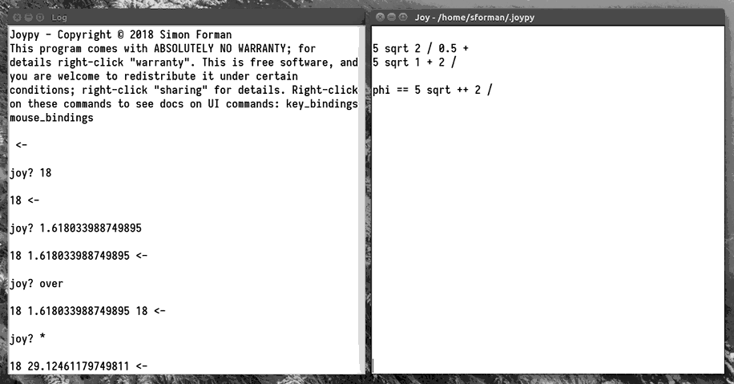

A Graphical User Interface
==============================

Eventually to be implemented in Joy for the Wirth RISC

- History
  - `Oberon OS`_
  - `"Humane Interface"`_ by Jef Raskin

- Structure
  - Text Windows  (no widgets.  Peripherals!)
  - Versioned File Repo JOY_HOME
  - World contains dictionary and stack, interprets commands

- Commands
  - Mouse Chords
  - Keyboard

- Output from Joy
  - print redirected to log text
  - command printed before each evaluation
  - stack printed after
  - Python Tracebacks pop up an "error" or "trap" text.

TODO: find the other stuff I've written about the UI and include it here.

The basic idea is that there is a single "space" or world that consists
of the stack, the dictionary, and the interpreter.  All operations are
performed by putting things onto the stack and running Joy commands on
them.  (Eventually there will be "meta-interpreter" actions.)  Joy
commands can be specified from the keyboard or by the mouse.  All history
is saved in a local VCS repository.  All content is static, as soon as
you stop typing or a command completes the current state of the system is
written to disk.  Previous history can be accessed and brought into the
current active world.

There aren't any widgets.  There aren't any menus.  Just text windows.

(I want to make and use physical peripherals, slider bars, knobs and
wheels, levers, dials, etc.)

`Tkinter UI`_
-------------------

Exists, pretty feature-complete MVP.

Pros: Simple, powerful, easy, low-overhead. Supports (simple) graphics canvas.

Cons: Leaning on Tkinter might raise the bar for the eventual self-hosted UI (i.e. undo/redo)?  Tkinter doesn't work well on mac (wtf Apple!?). Obscure, almost "Brutalist" interface.  (I like it but others don't.)  Runs slow on rPi

PyGame Model
----------------------------

Crude but functional, meant to serve as a model for Joy/RISC implementation.

Pros: Eat own dogfood. Runs fast-ish on rPi.
Establishes practicality of Joy code for "real" world problems.
Very technically satisfying, self-hosted.

Cons: Eat own dogfood. High overhead. Low on features. Kinda crude.

Web Browser
--------------

Write a server wrapper for Joy and use browser as UI.  (Or use e.g. websocketd.)

I have old experiments (including Joy in JS for the client-side) but nothing
mature.

Pros: Very simple on server-side. Lots of middleware. Path to distributed Joy systems. Can take advantage of e.g. SVG, Joy code only has to emit symbolic reprs, not handle implementation.

Cons: Reliant on browsers. Middling high overhead. Distracts from main thrust. Have to develop an API.

Meta-Interpreter Actions
------------------------------

Some actions are not defined within the scope of the world (the stack,
dictionary and interpreter.)

Backtime (History)
^^^^^^^^^^^^^^^^^^^^^^^^^^^^^

One primary example is accessing the
previous history of the world.  Because the current history is stored in
a git repository, you can use any git server (including the 'git serve'
command that is a part of Git) to access it to check diffs or recover old
content and commands.

IPFS and content addressing
^^^^^^^^^^^^^^^^^^^^^^^^^^^^^

TODO: something about permanent content-addressable global storage.  It's
a whole different concept.

Refactoring
^^^^^^^^^^^^^^^^^^^^^^^^^^^^^

.. _"Humane Interface": /ipfs/QmXoypizjW3WknFiJnKLwHCnL72vedxjQkDDP1mXWo6uco/wiki/The_Humane_Interface.html
.. _Oberon OS: /ipfs/QmXoypizjW3WknFiJnKLwHCnL72vedxjQkDDP1mXWo6uco/wiki/Oberon_(operating_system).html

.. _Tkinter UI: source/joypy/joy/gui

