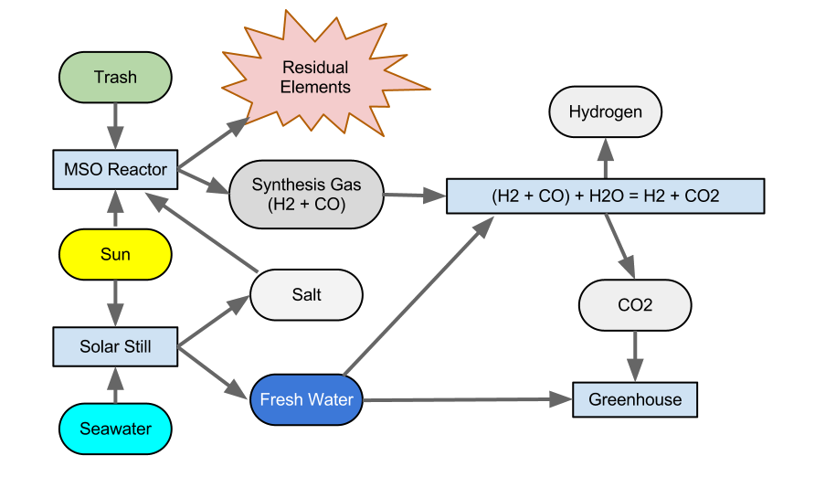

Large Flying Buildings
==========================

Introduction
-----------------

First of all, what are we talking about?

- Large: several kilometers or even larger.
- Flying: they spend most or all of the time in the air.
- Buildings: containing people and infrastructure.

How do we make them?  There are two areas to address:

- The methods of manufacturing them.
- The path from here & now to full production and deployment.

(You can think of this as one three-dimensional structure if you permit
the surface of the Earth to be treated as an approximately
two-dimensional manifold and take time as the third dimension.)

Purpose
-------------------------------

Clean up The Great Pacific Garbage Patch
^^^^^^^^^^^^^^^^^^^^^^^^^^^^^^^^^^^^^^^^^^^^^^^^^^^^^^

The original inspiration for doing this came from wanting to find a way to clean up
The Great Pacific Garbage Patch.
I figured the only way to do that was to mimic nature and create a simple artificial "ant farm"
that could start small and scale up to handle the problem.  Later on the idea of creating large
flying buildings sort of fell out of the original plan.

It's Inspiring.
^^^^^^^^^^^^^^^^^^^^^^^^^^^^^^^^^^^^^^^^^^^^^^^^^^^^^^

You don't have to be a futurist or
a science fiction fan to think flying buildings and flying
small cities are just a cool idea.

Mass Transport to deal with Climate Change
^^^^^^^^^^^^^^^^^^^^^^^^^^^^^^^^^^^^^^^^^^^^^^^^^^^^^^

Second, we're going to need to move a lot of people and material soon if
climate change keeps up, and this provides a cheap carbon-neutral method.

Homestead in the Sky
^^^^^^^^^^^^^^^^^^^^^^^^^^^^^^^^^^^^^^^^^^^^^^^^^^^^^^

We can use them as platforms and just live up there?

Preliminary Concepts and Background
-----------------------------------------

Bucky Fuller, geodesic and tensgresity structures.
^^^^^^^^^^^^^^^^^^^^^^^^^^^^^^^^^^^^^^^^^^^^^^^^^^^^^^

- https://en.wikipedia.org/wiki/Bucky_Fuller
- https://en.wikipedia.org/wiki/Bucky_Fuller#The_geodesic_dome
- https://en.wikipedia.org/wiki/Geodesic_dome
- https://en.wikipedia.org/wiki/Tensegrity
- https://en.wikipedia.org/wiki/Cloud_Nine_(tensegrity_sphere)

> In geometry, a geodesic is commonly a curve representing in some sense
the shortest[a] path between two points in a surface ... It is a
generalization of the notion of a "straight line" to a more general
setting. ~ https://en.wikipedia.org/wiki/Geodesic

Here "Geodesic" refers to a class of structures that get their strength
from their shape rather than the material they're made of.  Typically
they are spherical although other shapes are possible.  (Suspension
bridges could be thought of as geodesic structures.)  They use minimal
shapes for maximal efficiency.

"Tensgresity" refers to a structures made from a network of two kinds of
parts: pure compression struts and pure tension ligaments or lines.  The
word is a portmanteau of "tensional integrity".  These forms are
extremely light and strong.

(All tensgresity structures are geodesic but not vice versa.)

"Cloud Nine": Huge geodesic spheres made of aluminum struts
would float.  Sunlight bouncing around inside would heat up the air
inside, causing it to expand, displacing some air from the sphere.  If
the sphere is greater than 1/2 mile in diameter the amount of air
displaced would weigh more than the sphere itself, and so it would float
like a hot air balloon, even without a surface membrane.  If you add a
membrane it will float overnight.

"Octet truss": A specific kind of space-filling frame made of
tetrahedrons (or, if you like of octahedrons.)  I have a shoe box-sized
chunk of this that I made from toothpicks and glue.  It's really hard to
understand how strong and light it is without making and handling
examples.

(BTW, FWIW, Wikipedia is kinda a mess around this little eddy of subject
matter.  https://en.wikipedia.org/wiki/Octet_truss redirects to "Space
frame", and that article says "Alexander Graham Bell from 1898 to 1908
developed space frames based on tetrahedral geometry." and links to
"tetrahedral truss", but that just redirects to "Tetrahedral kite".  All
the "Space frame" article has to say about Bucky is, "Buckminster Fuller
patented the octet truss in 1961 while focusing on architectural
structures.")

Anyhow, the "octet truss" is a space-filling grid of octahedrons and
tetrahedrons with a very high strength to mass ratio.

Alexander Graham Bell's Cellular Kites
^^^^^^^^^^^^^^^^^^^^^^^^^^^^^^^^^^^^^^^^^^^^^^^^^^^^^^

"...came about from his experiments with Hargrave's box kites and his
attempts to build a kite that was scalable and big enough to carry both a
man and a motor."

- https://en.wikipedia.org/wiki/Tetrahedral_kite
- https://en.wikipedia.org/wiki/Hargrave_cellular_wing

I read that critics of heavier-than-air flight were saying that it was
impossible because the mass of a vehicle goes up as the cube of the
length while the surface area only goes up with the square, and Bell
wanted to show that that wasn't necessarily true.

By constructing a large kite by tessellation of many smaller kites the
surface area to mass ratio stays constant as the size changes.

Magnus effect
^^^^^^^^^^^^^^^^^^^^^^^^^^^^^^^^^^^^^^^^^^^^^^^^^^^^^^

The Magnus effect is the deflection of the path of a spinning object
moving through a fluid.

It "has some engineering uses, for instance in the design of rotor ships
and Flettner aeroplanes." ~ https://en.wikipedia.org/wiki/Magnus_effect

This used to be more obscure but has recently become more widely know
after some video of folks throwing basketballs off a dam went viral.  Now
there are lots of videos and folks making model aircraft, etc.

As it says in the Wikipedia entry:

> The lift on the cylinder per unit length, F/L, is the product of the
velocity, v (in metres per second), the density of the fluid, ρ (in
kg/m3), and the strength of the vortex that is established by the
rotation, G...

Where G is:

    G = 2πr²ω

where "ω is the angular velocity of spin of the cylinder (in radians / second)
and r is the radius of the cylinder (in metres)."

The thing to notice is that the lift goes up with the second power of the
radius of the rotor, so e.g., twice as large gets you four times as much
lift!

This suggests that kites that rotate or have rotating parts could
manipulate air pressure in useful ways.  ;-)

Various odds and bods
^^^^^^^^^^^^^^^^^^^^^^^^^^^^^^^^^^^^^^^^^^^^^^^^^^^^^^

Magenn (sic) wanted to manufacture tethered floating generators that used
the Magnus effect to stay aloft and to generate power.  The company went
out of business or something.

There was a company in Australia that had a prototype of a Magnus effect
vehicle that could do startling things.  I don't want to describe it
because I don't want to foster skepticism.  If I can find videos I'll
post them.

Tensairity - https://en.wikipedia.org/wiki/Tensairity The fundamental
discovery is that reinforced balloons are incredible strong.  Were talking
as strong as steel at a fraction of the mass.  Inflatable bridges, etc.
This is a whole class of structures.  The immediate obvious thing to do
is use "tensairity" to make the compression struts of tensgresity
structures.  People are already doing experiments like: "An inflatable
wing using the principle of Tensairity" https://repository.tudelft.nl/islandora/object/uuid:306785d0-f75b-4378-a145-75905c83efa7/?collection=research

Construction and Form
-----------------------------------------------------

See the `Cellular Fractal structures`_ subpage.

Consider the construction of a single tetrahedron "cell" (omitting the
sail for now.)  You need:

- Six struts.
- Four connectors.

The struts are identical as are the connectors.  The process (whatever it
is) to attach the struts to the connectors is identical so the machinery
to do it is identical.

So you only need two kinds of things (struts and connectors) and one kind
of vertex assembly robot.  You would arrange six strut dispensers so that
they hold six struts at a time in a tetrahedral shape and arrange four vertex
assembly robots to join them together simultaneously.

You would arrange 4n of those systems to produce four cells at once each
cycle and feed sets of four cells at a time to another stage that
connects their vertices to form a meta-tetrahedron.  You can arrange 16n
cell producers to produce 4n meta-tetrahedra and assemble those into
meta-meta-tetrahedra, and so on...  64n cell producers can produce one
meta-meta-meta-tetrahedra per construction cycle (Note that creating an
n-meta takes no more extra time than the 1-meta, as all connector joining
can happen in parallel.)

Now then, let's add sails and a drone's worth of chips, sensors, motors,
and battery, and now each cell is a self-directed glider/kite.  (It's not
quite a kite if it's not tethered.)

(I want to say upfront that the tetrahedron might not be the best design
for a self-directed kite form.  I've explored triangular tensgresity
prisms.  The obvious thing to imitate is the maple seed.  Cells can
maintain rotation with minimal power to "idle" in space.  The cellular
fractal design pattern works for most practical forms.)

If the individual cells are self-directed robots that can fly and join
formations immediately after construction then we don't actually have to
have an additional factory to assemble them into meta-cells.  They can
just do it themselves.

This also has implications for allocation of capacity and self-repair.  A
damaged mega-lifter can simply split on transient "seams", eject the
damaged sub-cells, and reform.  The sub-cells themselves can repeat the
process, etc., so that only the actually damaged struts and connectors
need to be replaced.  Everything else can be reused.  (This reminds me of
how "purely functional" data structures amortize cost of modifications.)

I also want to point out that I suspect that these structure will be
amenable to Finite Element analysis, which is nice.  Essentially they
are just large grids, eh?

How to get There from Here
--------------------------------------

If all you wanted to do was make a really big kite you could do that, you
would just need a lot of money.  You could buy bamboo poles, strong
lines, and some Tyvek housewrap and get to work.  Above a certain ratio
of surface area to mass it becomes difficult to keep a structure on the
ground.  Before long your biggest problem would be keeping the thing on
the ground.

But it's not enough to "build it and they will come".

Can we make money with this?  Is there a market for this kind of aerial
transportation?  A business model?

Can we at least explore the space without going broke?

I think I can sort of self-fund this thing, and do it in a way that lets
me validate demand and all that at each stage.  Without going on and on
about it, here's my general drift:

#) Toys and kits.
#) Drones
#) "Sky yachts" for hobbyists
#) Heavy lifters
#) Worldkite

These aren't meant to be hard divisions, more like an unfolding from
smaller and simpler to bigger and more involved.  Each stage lays the
foundation for the next.

Cleaning up the Great Pacific Garbage Patch
-----------------------------------------------------

This project has two main intertwined strands, one involving correct
software and the other cellular swarm robots for garbage collection.

The initial swarm will be ocean-going and work to clean up the `Great
Pacific Garbage Patch`_ (and eventually other gyres) and then expand into
terrestrial "litter-bots".  There's also an aerial component, as well as
a simple secure OS to run them.  The software is coming along nicely and
I'm working on the first prototypes.

The oceanic environment, although harsher physically, is semantically
much simpler than the terrestrial environment so the challenges
of programming a robot to deal with living in the ocean are much simpler
than those of operation on land.
Oceanic trash is mostly plastic and represents a trove of carbon atoms arranged in
long-chain polymers.  I know of at least two methods to
recycle it into new, useful forms: `Thermal Depolymerization`_ (TDP) and
`Molten Salt Oxidation`_ (MSO.)  TPD converts plastic back into a crude
liquid form (in other words, fuel) while MSO converts it into something
called "synthesis gas" or syngas, which has a lot of industrial uses.
Both TPD and MSO are exothermic reactions, and `MSO can also be used with
nuclear fuel to make safe atomic reactors`_.  So, in theory, power is not a
limiting factor.

The swarm will collect and reprocess waste into more litterbots.  The
self-replication will enable a small "seed" system to grow to cope with
the amount of trash no matter how large.  Once throughput of the trash
collecting system is great enough to deal with existing and future trash
flows, excess capacity can be repurposed or recycled.

Geodesic design and the `Magnus effect`_ permit aerial swarm robots
that can combine in cellular forms (cf. Alexander G. Bell's cellular
kites) to make large, permanently aloft structures, basically flying
buildings, to enable mass transport for dealing with climate change, etc.
If the surface-area-to-mass ratio is above a certain limit, the challenge
is to keep things down, rather than to get them aloft.  With intelligent
control a "kite" can stay aloft 24/7 and there is effectively no upper
limit to size (cf. Bucky Fuller's `Cloud 9`_, "city in the sky".)

So that's one strand.

The other strand is a system of provably-correct software development
that's easy enough for a non-programmer to use with minimal coaching.
It's based on the work of Dr. Margaret Hamilton coming out of the Apollo
11 program.  (The book `"System Design from Provably-Correct Constructs"`_
by James Martin is probably the best source on it.)

I'm combining that with a logical hardware model based on a notation
called the "Laws of Form" (from a book of the same name by George
Spencer-Brown), and with the Joy programming language (by Manfred von
Thun), to enable me to write provably-correct systems "down to the metal"
in a simple and self-contained codebase.

Putting it all together, I'm building a system that enables normal people
to program computers easily with correct bug-free results, and use it to
build a self-replicating robot swarm to collect and recycle the world's
trash, enable mass transport of material and people, and provide power,
fresh water, and structural materials globally.

Marine Litterbots
^^^^^^^^^^^^^^^^^^^^^

This is a crude schematic of the basic design of a marine robot.

.. image:: images/Basic-Design.png

It's just a sphere with a keel and a sail and some electronics.  It's only
capability as such would be to navigate around the seas.

One of the very first extensions of this basic design would be allowing
them to find and connect to each other to form filaments.  If a
net or curtain hung below a filament it could act as a collector of
floating trash.  Each member of the filament is mobile and together they
could lasso trash for further processign by other parts of the system.

If they're fitted with ports these simple sphere-shaped bots can store
and transport cargo inside the spheres.

Modifications to the basic sphere-shape are easy to imagine: fish, "needle" buoy, etc...

"Metabolism"
^^^^^^^^^^^^^^^^^^^^^^^^

This is a crude schematic of the basic recycling "metabolism" for converting marine trash into biomass.

The four blue rectangles are the main processing plants:

#) MSO Reactor

   This takes in trash, solar energy, and salt, and produces Syngas and residual elements.

#) Solar Still

   This takes in solar energy and salt water, and produces fresh water and salt.

#) Water Column

   This takes in syngas and fresh water, and produces hydrogen and carbon dioxide.

#) Greenhouse

   This takes in  solar energy, fresh water, and carbon dioxide, and produces biomass

Provably Correct Software
---------------------------------

Computers are a mapping between *human intentions* and *automatic machinery*.

- A machine doing work that contributes to no intention is waste.
- Human intentions must be harmonized or we just have mechanized war.

  - Core Transformation Process provides a perfect negotiation algorithm.

- Human intentions must be *ecological* or we will destroy ourselves.

  - Nature forms the source of sanity in an increasingly-mediated sensorium.

Kinds of Computers:

- Calculator mode - well-defined functions on well-defined data.  Up to e.g. Jupyter notebooks.
- Robots - self-contained and at least partly autonomous; mobile; interacts with environment.  Modeled on animals.
- Factory - stationary; processes a flow; often single-purpose. Modeled on plants.
- Art - Video games, demo scene, music, videos, etc.

(I'm mostly concerned with the first three, but there's no reason your
music synth should be buggy.)

Basic recipe for correct, minimal code:

- LoF to describe hardware
- Joy to orchestrate it
- HOS to develop Joy
- and Prolog to write new machine code.

LoF Circuits
^^^^^^^^^^^^^^^^^^^^^^^^^^^^^^

In order to make trustworthy software you need to have trustworthy hardware,
and for that you need to be able to prove, with symbolic logic, the
behaviour of the circuits.  A LoF expression is simultaneously
a circuit schematic and a statement of binary Boolean logic.

- Laws of Form by George Spencer-Brown

  - `Markable Mark`_ website of George Burnett-Stuart
  - Symbolic Logic notation
  - hardware model
  - Circuits are proofs.
  - `"Correcr Programming"`_

    - Symbolic Logic in the Laws of Form
    - Building Circuits
    - Simplifying Expressions
    - SAT Solver
    - A Model of Computation

Joy
^^^^^^^^^^^^^^^^^^^^^^^^^^^^^^

- UI language

  - CLI
  - Mouse chords

- Refactoring
- Compiling

  - to Prolog
  - to Python
  - to Factor, to machine code
  - to Wirth RISC

- Implementations
  - Joypy (Joy in Python)
  - Thun (Joy in Prolog)
  - Joy Asm (Joy in Wirth RISC machine code)

Hamilton's HOS
^^^^^^^^^^^^^^^^^^^^^^^^^^^^^^

If you're typing code into a text editor and *hoping* that it describes a
correct program, you're doing it wrong.

By starting with a simple correct program and only modifying it by means
of correctness-preserving operations we can develop software that is
automatically proven-correct.

- Dr. Margaret Hamilton's Higher-Order Software

  - `"System Design from Provably-Correct Constructs"`_ by James Martin
  - As yet kinda unimplemented in the Joy, Python, and Prolog code I've written so far.

The demo UI kinda has a tiny bit of failure-proofing in that it shows
you, when you hover the mouse over a command, whether or not it will work
with the current stack.  But writing new Joy functions is still totally
by hand.  HOS would seem to me to imply a system that lets the user
author new commands by a process of differentiating some initial blank
(or library) command by certain provably-correct operations only.  In any
event, the commands to "inscribe" new commands should guard against
invalid programs.  (Any [in]valid programs that the guard cannot
recognize are of interest!)

Prolog for Machine Code
^^^^^^^^^^^^^^^^^^^^^^^^^^^^^^

Very recently I've learned of extensive work done towards provably
correct compilation in Prolog.  It seems like this is the way to go to
get from Joy to the metal.  Here are some of the papers I've found:

- "Logic Programming and Compiler Writing" David H. D. Warren (this is the kickoff.)
- "Parsing and Compiling Using Prolog" Jacques Cohen and Timothy J. Hickey
- "Provably Correct Code Generation: A Case Study" Qian Wang, Gopal Gupta
- "From Programs to Object Code and back again using Logic Programming: Compilation and Decompilation" Jonathan Peter Bowen
- "Automatic Derivation of Code Generators from Machine Descriptions" R. G. G. Cattell

To Do
-----------------

- Add more links.

  - The code

    - Thun (Prolog code for interpreter and compilers.)
    - Joypy?  It's still useful.
    - Joypy GUI demos.

      - Tkinter
      - SDL

- Research organic marine glue

  - Easy, cheap, durable
  - ecological

    - non-toxic
    - sourced from something that won't miss it (i.e. kelp or microbes.)
    - can be eaten (eventually) by something (The main reason why plastic trash is such a problem is that almost nothing can eat it.)

  - All of the above for both tethers and membranes.

Misc. Additional Subjects
-------------------------------

In no particular order.

- Prolog-implemented provably-correct compilers

  - Joy to Prolog
  - Prolog to machine code
  - Joy to machine code
  - Code generator generators from machine descriptions

- `GUI`_

  - "Humane Interface" by Jef Raskin
  - Oberon OS
  - Joy PL as unifying metaphor

- Biomimetic structures and processes

  - Pemaculture (applied ecology) for

    #) industrial cleanup
    #) manufacturing

  - Recycling/"metabolic" processes

    - `Thermal Depolymerization`_ (TDP)
      - modest pressure and temp (~300C IIRC)
      - liquid slurry (like dirty oil.)
      - can be remanufactured into low-grade plastic (feed stock for 3D printing, maybe?)
      - Dunno about separating useful/useless parts

    - `Molten Salt Oxidation`_ (MSO)
      - low pressure, high (~3000C) temp
      - essentially burning under liquid molten salt, exothermic
      - plenty of salt in Ocean.  Salt candle?
      - salt extraction is fresh water production, eh?
      - Handles all inputs.
      - Output is highly factored.
      - Syngas + junk molecules.
      - Junk collects in the salt bath...

    - Separation of living organisms from plastic
      - detecting life
      - partitioning biomass from inanimate material
      - conserving biomass, what to do with the organisms?
        - eject? Where do they go?
        - foster? How to construct ecological habitat?

  - `Cellular Fractal structures`_

    - Alexander G. Bell's cellular kites
    - Cellular structure means that the volume-to-surface ratio
      doesn't change as the structure scales.  Bell wanted to show that
      heavier-than-air craft were not doomed to be no more than
      bird-sized.

  - Construction methods of cellular structures

    - Simple units with simple construction algorithms
    - Combined in simple ways that typically share the same
      construction algorithm (meaning connections between cells
      resemble the connections that make the cells.)
    - Self-similar on multiple scales; Fractal.
      (Compact descriptions.)
    - Should be easy to model with Finite Element methods.
    - Large-scale structures can be designed to "degrade" gracefully.
      For example, large fractal structures can break and reform along
      the boundaries of their sub-assemblies, rather than submit to
      catastrophic failure.
    - Cellular structures have anisotopy (sp?)
    - Quasi-crystalline

    - Tubes
      - Toilet paper tubes glued together in triplets
      - Triplets glued together (similar construction algorithm) into larger triplets and tiled to make a plane.
      - Modify diameter (3D printer) of tubes (now e.g. conic sections) to curve plane.
      - Make cellular "polycoque" (it's not a monocoque) (sp?) for strong gracefully curved hulls, buildings, buckheads, &c.
      - Cover with some sort of laminate or membrane.
      - Requires:
        - 3D printers
        - Glue
        - some sort of frame or scaffolding
        - software support

- Spittlebug architecture (Foam)

  - Spheres (same as tubes but with spheres).

    - Even simpler manufacturing: just bubble a gas through a e.g. plastic soup and collect the bubbles.
    - Quality control with 3D scanning and acoustic sounding.
    - Sort by size is easy.
    - Grab anywhere with a little suction cup.
    - Automatically aligned when placed in position.
    - Great glue behaviour

      - pressure
      - curvature
      - "squish"

  - Space ships and stations

    - self-repairing
    - handles impacts gracefully

  - Oceanic structures

    - weather storms (break apart and reform)
    - storage for e.g. fresh water and other materials

  - Fractal Nested (Biomimetic)

    - Spheres within spheres
    - Vacuoles (sp?)
    - Conserve (if the outer sphere breaks the inner ones disperse but survive to be collected again.)

- Bucky Fuller

  - Geodesic design
    - `Geometry files`_ (STL, OpenSCAD, etc.)

  - Tensegrity

    - Tensairity_ ( `Tensairity Solutions`_ ) I sure hope these guys let
      me use their idea!  It's the ultimate expression of tensegrity
      (not counting atomic/molecular structures.)

  - `Cloud 9`_, "city in the sky"

  - Global engineering

- `Magnus effect`_
  - Lift goes up with the square of the radius
  - So, with cellular structures where the mass is linear in the radius, you eventually get enough lift to overcome gravity, and then some.
  - `Magnus Motive`_ company to make machines.

- `Great Pacific Garbage Patch`_
  - Source of carbon (H, N, O, and salt, etc. are plentiful on the ocean.)
  - Must be able to filter inorganic from organic
  - sequester dangerous atoms, molecules.

- Litterbots

  - Marine
  - Terrestrial
  - Aerial
  - Orbit/Space

- Prof. Wirth's RISC CPU for Project Oberon

  - Small, elegant, capable
  - Good for educational purposes
  - Emulators in C, JS, Java, Python, etc...
  - Verilog for FPGAs

.. _"Correcr Programming": source/joypy/docs/Correcet_Programming.html
.. _"System Design from Provably-Correct Constructs": https://archive.org/details/systemdesignfrom00mart
.. _Cellular Fractal structures: Cellular-Fractal-Structures.html
.. _Cloud 9: https://en.wikipedia.org/wiki/Cloud_Nine_(tensegrity_sphere)
.. _GUI: GUI.html
.. _Geometry files: https://github.com/PhoenixBureau/MagnusMotive/tree/main/geometry
.. _Great Pacific garbage patch: https://en.wikipedia.org/wiki/Great_Pacific_garbage_patch
.. _Linux kernel archive: https://www.kernel.org/
.. _MSO can also be used with nuclear fuel to make safe atomic reactors: https://en.wikipedia.org/wiki/Molten_salt_reactor
.. _Magnus Motive: MagnusMotive.html
.. _Magnus effect: https://en.wikipedia.org/wiki/Magnus_effect
.. _Markable Mark: http://www.markability.net/
.. _Molten salt oxidation: https://en.wikipedia.org/wiki/Molten_salt_oxidation
.. _Pandoc: https://pandoc.org/
.. _Tensairity Solutions: http://www.tensairitysolutions.com
.. _Tensairity: https://en.wikipedia.org/wiki/Tensairity
.. _Thermal Depolymerization: https://en.wikipedia.org/wiki/Thermal_depolymerization
.. _Wikipedia: https://www.wikipedia.org/

