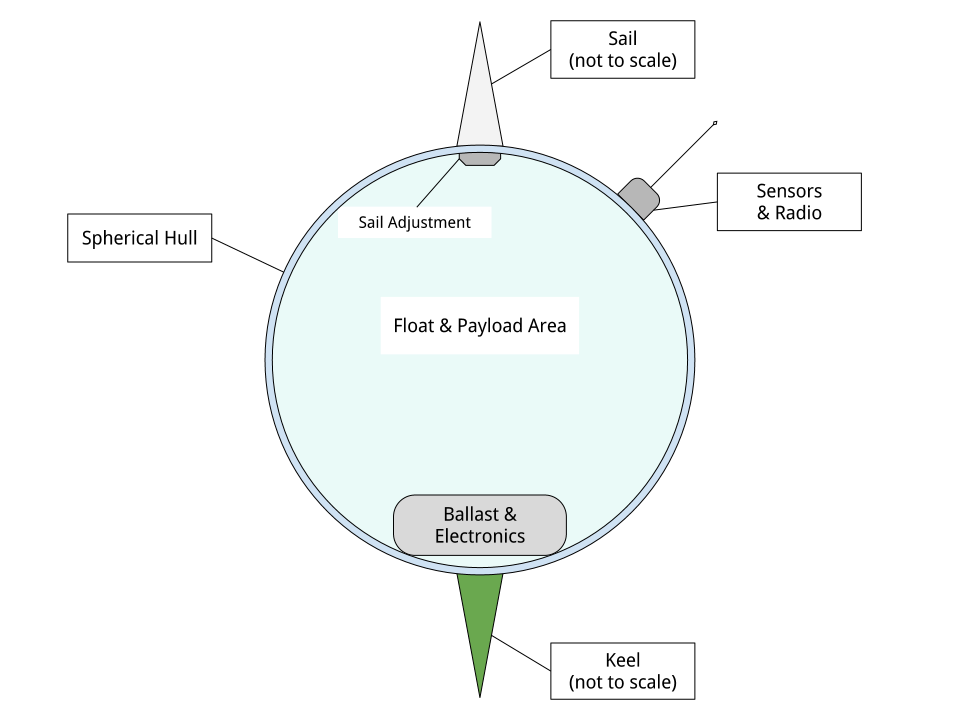

Large Flying Buildings
==========================

Introduction
-----------------

This project has two main intertwined strands, one involving correct
software and the other cellular swarm robots for garbage collection.

The initial swarm will be ocean-going and work to clean up the `Great
Pacific Garbage Patch`_ (and eventually other gyres) and then expand into
terrestrial "litter-bots".  There's also an aerial component, as well as
a simple secure OS to run them.  The software is coming along nicely and
I'm working on the first prototypes.

Details
-----------------

The oceanic environment, although harsher physically, is semantically
much simpler than the terrestrial environment.  This means the challenges
of programming a robot to deal with living in the ocean are much simpler
than the challenges of dealing with operation on land.  Oceanic trash is
mostly plastic and represents a trove of carbon atoms arranged in
long-chain polymers.  There are (at least) two economical methods to
recycle it into new, useful forms: `Thermal Depolymerization`_ (TDP) and
`Molten Salt Oxidation`_ (MSO.)  TPD converts plastic back into a crude
liquid form (in other words, fuel) while MSO converts it into something
called "synthesis gas" or syngas, which has a lot of industrial uses.
Both TPD and MSO are exothermic reactions, and `MSO can also be used with
nuclear fuel to make safe atomic reactors`_.  So, in theory, power is not a
limiting factor.

The swarm will collect and reprocess waste into more litterbots.  The
self-replication will enable a small "seed" system to grow to cope with
the amount of trash no matter how large.  Once throughput of the trash
collecting system is great enough to deal with existing and future trash
flows, excess capacity will be repurposed.

Geodesic design and the `Magnus effect`_ let me build aerial swarm robots
that can combine in cellular forms (cf. Alexander G. Bell's cellular
kites) to make large, permanently aloft structures, basically flying
buildings, to enable mass transport for dealing with climate change, etc.
If the mass-to-surface-area ratio is above a certain limit, the challenge
is to keep things down, rather than to get them aloft.  With intelligent
control a "kite" can stay aloft 24/7 and there is effectively no upper
limit to size (cf. Bucky Fuller's `Cloud 9`_, "city in the sky".)

So that's one strand.

The other strand is a system of provably-correct software development
that's easy enough for a non-programmer to use with minimal coaching.
It's based on the work of Dr. Margaret Hamilton coming out of the Apollo
11 program.  (The book `"System Design from Provably-Correct Constructs"`_
by James Martin is probably the best source on it.)

I'm combining that with a logical hardware model based on a notation
called the "Laws of Form" (from a book of the same name by George
Spencer-Brown), and with the Joy programming language (by Manfred von
Thun), to enable me to write provably-correct systems "down to the metal"
in a simple and self-contained codebase.  (I was concerned that my swarm
of robots should not be suborned and made to act improperly.)

Putting it all together, I'm building a system that enables normal people
to program computers easily with correct bug-free results, and use it to
build a self-replicating robot swarm to collect and recycle the world's
trash, enable mass transport of material and people, and provide power,
fresh water, and structural materials globally.

Marine Litterbots
-----------------

This is a crude schematic of the basic design of a marine robot.

It's just a sphere with a keel and a sail and some electronics.  It's only
capability as such would be to navigate around the seas.

One of the very first extensions of this basic design would be allowing
them to find and connect to each other to form filaments.  If a
net or curtain hung below a filament it could act as a collector of
floating trash.  Each member of the filament is mobile and together they
could lasso trash for further processign by other parts of the system.

If they're fitted with ports these simple sphere-shaped bots can store
and transport cargo inside the spheres.

Modifications to the basic sphere-shape are easy to imagine: fish, "needle" buoy, etc...

"Metabolism"
-----------------

This is a crude schematic of the basic recycling "metabolism" for converting marine trash into biomass.

.. image:: images/Recycling-Process-Outline-wb.png

The four blue rectangles are the main processing plants (no pun intended).

#) MSO Reactor

   This takes in trash, solar energy, and salt, and produces Syngas and residual elements.

#) Solar Still

   This takes in solar energy and salt water, and produces fresh water and salt.

#) Water Column

   This takes in syngas and fresh water, and produces hydrogen and carbon dioxide.

#) Greenhouse

   This takes in  solar energy, fresh water, and carbon dioxide, and produces biomass

Provably Correct Software
---------------------------------

Computers are a mapping between *human intentions* and *automatic machinery*.

- A machine doing work that contributes to no intention is waste.
- Human intentions must be harmonized or we just have mechanized war.

  - Core Transformation Process provides a perfect negotiation algorithm.

- Human intentions must be *ecological* or we will destroy ourselves.

  - Nature forms the source of sanity in an increasingly-mediated sensorium.

Kinds of Computers:

- Calculator mode - well-defined functions on well-defined data.  Up to e.g. Jupyter notebooks.
- Robots - self-contained and at least partly autonomous; mobile; interacts with environment.  Modeled on animals.
- Factory - stationary; processes a flow; often single-purpose. Modeled on plants.
- Art - Video games, demo scene, music, videos, etc.

I'm mostly concerned with the first three, but there's no reason your
music synth should be buggy.

Basic recipe for correct, minimal code: LoF to describe hardware, Joy to
orchestrate it, HOS to develop Joy, and Prolog to write new machine code.

LoF Circuits
^^^^^^^^^^^^^^^^^^^^^^^^^^^^^^

In order to make trustworthy software you need to have trustworthy hardware,
and for that you need to be able to prove, with symbolic logic, the
behaviour of the circuits.  A LoF expression is simultaneously
a circuit schematic and a statement of binary Boolean logic.

- Laws of Form by George Spencer-Brown

  - "Markable Mark" website of George Burrnett-Stewart (sp?)
  - Symbolic Logic notation
  - hardware model
  - Circuits are proofs.
  - `"Correcr Programming"`_

    - Symbolic Logic in the Laws of Form
    - Building Circuits
    - Simplifying Expressions
    - SAT Solver
    - A Model of Computation

Joy
^^^^^^^^^^^^^^^^^^^^^^^^^^^^^^

- UI language

  - CLI
  - Mouse chords

- Refactoring
- Compiling

  - to Prolog
  - to Python
  - to Factor, to machine code
  - to Wirth RISC

- Implementations
  - Joypy (Joy in Python)
  - Thun (Joy in Prolog)
  - Joy Asm (Joy in Wirth RISC machine code)

Hamilton's HOS
^^^^^^^^^^^^^^^^^^^^^^^^^^^^^^

If you're typing code into a text editor and *hoping* that it describes a
correct program, you're doing it wrong.

By starting with a simple correct program and only modifying it by means
of correctness-preserving operations we can develop software that is
automatically proven-correct.

- Dr. Margaret Hamilton's Higher-Order Software

  - `"System Design from Provably-Correct Constructs"`_ by James Martin
  - As yet kinda unimplemented in the Joy, Python, and Prolog code I've written so far.

The demo UI kinda has a tiny bit of failure-proofing in that it shows
you, when you hover the mouse over a command, whether or not it will work
with the current stack.  But writing new Joy functions is still totally
by hand.  HOS would seem to me to imply a system that lets the user
author new commands by a process of differentiating some initial blank
(or library) command by certain provably-correct operations only.  In any
event, the commands to "inscribe" new commands should guard against
invalid programs.  (Any [in]valid programs that the guard cannot
recognize are of interest!)

Prolog for Machine Code
^^^^^^^^^^^^^^^^^^^^^^^^^^^^^^

Very recently I've learned of extensive work done towards provably
correct compilation in Prolog.  It seems like this is the way to go to
get from Joy to the metal.  Here are some of the papers I've found:

- "Logic Programming and Compiler Writing" David H. D. Warren (this is the kickoff.)
- "Parsing and Compiling Using Prolog" Jacques Cohen and Timothy J. Hickey
- "Provably Correct Code Generation: A Case Study" Qian Wang, Gopal Gupta
- "From Programs to Object Code and back again using Logic Programming: Compilation and Decompilation" Jonathan Peter Bowen
- "Automatic Derivation of Code Generators from Machine Descriptions" R. G. G. Cattell

To Do
-----------------

- Add more links.

- Research organic marine glue

  - Easy, cheap, durable
  - ecological

    - non-toxic
    - sourced from something that won't miss it (i.e. kelp or microbes.)
    - can be eaten (eventually) by something (The main reason why plastic trash is such a problem is that almost nothing can eat it.)

  - All of the above for both tethers and membranes.

- Include

  - The code

    - Thun (Prolog code for interpreter and compilers.)
    - Joypy?  It's still useful.
    - Joypy GUI demos.

      - Tkinter
      - SDL

Misc. Additional Subjects
-------------------------------

In no particular order.

- Prolog-implemented provably-correct compilers

  - Joy to Prolog
  - Prolog to machine code
  - Joy to machine code
  - Code generator generators from machine descriptions

- `GUI`_

  - "Humane Interface" by Jef Raskin
  - Oberon OS
  - Joy PL as unifying metaphor

- Biomimetic structures and processes

  - Pemaculture (applied ecology) for

    #) industrial cleanup
    #) manufacturing

  - Recycling/"metabolic" processes

    - `Thermal Depolymerization`_ (TDP)
      - modest pressure and temp (~300C IIRC)
      - liquid slurry (like dirty oil.)
      - can be remanufactured into low-grade plastic (feed stock for 3D printing, maybe?)
      - Dunno about separating useful/useless parts

    - `Molten Salt Oxidation`_ (MSO)
      - low pressure, high (~3000C) temp
      - essentially burning under liquid molten salt, exothermic
      - plenty of salt in Ocean.  Salt candle?
      - salt extraction is fresh water production, eh?
      - Handles all inputs.
      - Output is highly factored.
      - Syngas + junk molecules.
      - Junk collects in the salt bath...

    - Separation of living organisms from plastic
      - detecting life
      - partitioning biomass from inanimate material
      - conserving biomass, what to do with the organisms?
        - eject? Where do they go?
        - foster? How to construct ecological habitat?

  - `Cellular Fractal structures`_

    - Alexander G. Bell's cellular kites
    - Cellular structure means that the volume-to-surface ratio
      doesn't change as the structure scales.  Bell wanted to show that
      heavier-than-air craft were not doomed to be no more than
      bird-sized.

  - Construction methods of cellular structures

    - Simple units with simple construction algorithms
    - Combined in simple ways that typically share the same
      construction algorithm (meaning connections between cells
      resemble the connections that make the cells.)
    - Self-similar on multiple scales; Fractal.
      (Compact descriptions.)
    - Should be easy to model with Finite Element methods.
    - Large-scale structures can be designed to "degrade" gracefully.
      For example, large fractal structures can break and reform along
      the boundaries of their sub-assemblies, rather than submit to
      catastrophic failure.
    - Cellular structures have anisotopy (sp?)
    - Quasi-crystalline

    - Tubes
      - Toilet paper tubes glued together in triplets
      - Triplets glued together (similar construction algorithm) into larger triplets and tiled to make a plane.
      - Modify diameter (3D printer) of tubes (now e.g. conic sections) to curve plane.
      - Make cellular "polycoque" (it's not a monocoque) (sp?) for strong gracefully curved hulls, buildings, buckheads, &c.
      - Cover with some sort of laminate or membrane.
      - Requires:
        - 3D printers
        - Glue
        - some sort of frame or scaffolding
        - software support

- Spittlebug architecture (Foam)

  - Spheres (same as tubes but with spheres).

    - Even simpler manufacturing: just bubble a gas through a e.g. plastic soup and collect the bubbles.
    - Quality control with 3D scanning and acoustic sounding.
    - Sort by size is easy.
    - Grab anywhere with a little suction cup.
    - Automatically aligned when placed in position.
    - Great glue behaviour

      - pressure
      - curvature
      - "squish"

  - Space ships and stations

    - self-repairing
    - handles impacts gracefully

  - Oceanic structures

    - weather storms (break apart and reform)
    - storage for e.g. fresh water and other materials

  - Fractal Nested (Biomimetic)

    - Spheres within spheres
    - Vacuoles (sp?)
    - Conserve (if the outer sphere breaks the inner ones disperse but survive to be collected again.)

- Bucky Fuller

  - Geodesic design
    - `Geometry files`_ (STL, OpenSCAD, etc.)

  - Tensegrity

    - Tensairity_ ( `Tensairity Solutions`_ ) I sure hope these guys let
      me use their idea!  It's the ultimate expression of tensegrity
      (not counting atomic/molecular structures.)

  - `Cloud 9`_, "city in the sky"

  - Global engineering

- `Magnus effect`_
  - Lift goes up with the square of the radius
  - So, with cellular structures where the mass is linear in the radius, you eventually get enough lift to overcome gravity, and then some.
  - `Magnus Motive`_ company to make machines.

- `Great Pacific Garbage Patch`_
  - Source of carbon (H, N, O, and salt, etc. are plentiful on the ocean.)
  - Must be able to filter inorganic from organic
  - sequester dangerous atoms, molecules.

- Litterbots

  - Marine
  - Terrestrial
  - Aerial
  - LEO

- Prof. Wirth's RISC CPU for Project Oberon

  - Small, elegant, capable
  - Good for educational purposes
  - Emulators in C, JS, Java, Python, etc...
  - Verilog for FPGAs

.. _"Correcr Programming": source/joypy/docs/Correcet_Programming.html
.. _"System Design from Provably-Correct Constructs": https://archive.org/details/systemdesignfrom00mart
.. _Cellular Fractal structures: Cellular-Fractal-Structures.html
.. _Cloud 9: https://en.wikipedia.org/wiki/Cloud_Nine_(tensegrity_sphere).html
.. _GUI: GUI.html
.. _Geometry files: source/geometry
.. _Great Pacific garbage patch: https://en.wikipedia.org/wiki/Great_Pacific_garbage_patch.html
.. _Linux kernel archive: https://www.kernel.org/
.. _MSO can also be used with nuclear fuel to make safe atomic reactors: https://en.wikipedia.org/wiki/Molten_salt_reactor.html
.. _Magnus Motive: MagnusMotive.html
.. _Magnus effect: https://en.wikipedia.org/wiki/Magnus_effect.html
.. _Molten salt oxidation: https://en.wikipedia.org/wiki/Molten_salt_oxidation.html
.. _Pandoc: https://pandoc.org/
.. _Tensairity Solutions: http://www.tensairitysolutions.com
.. _Tensairity: https://en.wikipedia.org/wiki/Tensairity.html
.. _Thermal Depolymerization: https://en.wikipedia.org/wiki/Thermal_depolymerization.html
.. _Wikipedia: https://www.wikipedia.org/

